#  Multi-Functional Arduino Robot

<div align="center">


**A versatile, multi-mode robot controlled by Arduino Uno — combining automation, wireless control, and voice interaction.**

[Features](#-features) • [Getting Started](#-getting-started) • [Documentation](#-documentation) • [Contributing](#-contributing)

</div>

---

## 📜 Project Overview

This project presents a **multi-functional, cost-effective robotic platform** that can operate in three intelligent modes:

- 🛰 **Autonomous Obstacle Avoidance**
- 📱 **Bluetooth Remote Control** via smartphone
- 🎤 **Voice Command Operation**

All modes are unified under a single Arduino program, making this robot an adaptable prototype for students, hobbyists, and researchers exploring robotics, IoT, and embedded systems.

---

## ✨ Features


---

## 🎯 Project Objectives

| Goal | Description |
|------|-------------|
| 🧩 **Design** | Build a mobile robot chassis using Arduino Uno, motors, a driver shield, and sensors |
| ⚙️ **Automate** | Implement autonomous obstacle avoidance using an HC-SR04 ultrasonic sensor |
| 📱 **Connect** | Enable wireless control through an HC-05 Bluetooth module and a smartphone app |
| 🎙 **Listen** | Integrate voice recognition for hands-free command control |
| 🔁 **Unify** | Merge all functionalities into a single cohesive program that allows mode switching |

---

## 🧠 System Architecture


### How It Works (The Brain)

At its core lies the **Arduino Uno**, functioning as the robot's microcontroller-based brain.

- **Code Environment:** Written and uploaded via the Arduino IDE
- **Inputs:** Ultrasonic distance data, Bluetooth commands, and voice signals
- **Outputs:** Controls motors, servos, and LEDs to execute actions
- **Processing:** Reads inputs from sensors and sends outputs to actuators — controlling motion, direction, and response logic

---

## 🤖 Modes of Operation


### 1. 🛰 Autonomous Mode – *"How does it see?"*

Using the **HC-SR04 Ultrasonic Sensor**, the robot perceives obstacles within a **15 cm radius**.

- Automatically stops when obstacle detected
- Evaluates surroundings using servo-mounted sensor
- Navigates around objects using real-time distance feedback
- Continuous scanning while moving

### 2. 📲 Bluetooth Mode – *"How do you take control?"*

The **HC-05 Bluetooth Module** connects to a smartphone via a control app (e.g., SriTu Hobby).

**Through the app, users can:**
- ⬆️ Move forward, backward, left, or right
- 🎚 Adjust speed or stop the robot remotely
- 🔄 Toggle between control modes
- 📊 Monitor robot status

### 3. 🎤 Voice Mode – *"How does it listen?"*

The robot accepts spoken commands using a compatible voice recognition interface (e.g., Android voice control app).

**Example voice commands:**
- *"Move forward"*
- *"Turn left"*
- *"Stop"*
- *"Reverse"*

This provides a **hands-free, intuitive** way to operate the robot.

---

## 🛠 Core Components

| Component | Role | Specifications |
|-----------|------|----------------|
| **Arduino Uno** | Central microcontroller ("Brain") | ATmega328P, 16MHz |
| **L293D Motor Driver Shield** | Controls direction and speed of DC motors | Dual H-Bridge, 600mA per channel |
| **HC-SR04 Ultrasonic Sensor** | Detects obstacles for autonomous mode | Range: 2cm - 400cm |
| **HC-05 Bluetooth Module** | Enables wireless communication | Bluetooth 2.0, Range: ~10m |
| **DC Gear Motors & Wheels** | Provide mobility | 6V, with gear reduction |
| **Servo Motor (SG90)** | Rotates the ultrasonic sensor | 180° rotation |
| **Li-ion Batteries** | Power source for both logic and motors | 7.4V or 11.1V pack |
| **LEDs** | Status indicators | Optional visual feedback |

---

## ⚡ Circuit Overview


### 🧩 Wiring Summary

| Component | Arduino Connection |
|-----------|-------------------|
| **Ultrasonic Sensor** | Trig → Pin 9, Echo → Pin 10 |
| **Motor Driver Shield** | Stacked on Arduino, Motors to M1/M2 terminals |
| **HC-05 Bluetooth** | TX → RX (Pin 0), RX → TX (Pin 1) |
| **Servo Motor** | Signal → Pin 11, VCC → 5V, GND → GND |
| **Power Supply** | Battery+ → Vin, Battery- → GND |

> 📁 **Detailed wiring diagram** is included in the `/docs` or `/hardware` folder.

---

## 💻 Software Architecture

```mermaid
flowchart TD
    Start([Power On]) --> Init[Initialize Systems]
    Init --> Setup[Setup:<br/>• Configure Pins<br/>• Initialize Servo<br/>• Start Bluetooth<br/>• Calibrate Sensors]
    Setup --> Loop[Main Loop]
    
    Loop --> CheckMode{Check<br/>Current Mode}
    
    CheckMode -->|Mode 1| Auto[Autonomous Mode]
    CheckMode -->|Mode 2| BT[Bluetooth Mode]
    CheckMode -->|Mode 3| Voice[Voice Mode]
    
    Auto --> ReadSensor[Read Ultrasonic<br/>Distance]
    ReadSensor --> Decision{Distance<br/>< 15cm?}
    Decision -->|Yes| Avoid[Obstacle Avoidance:<br/>• Stop<br/>• Scan Left/Right<br/>• Choose Direction]
    Decision -->|No| Forward[Move Forward]
    Avoid --> Loop
    Forward --> Loop
    
    BT --> CheckBT{Bluetooth<br/>Data Available?}
    CheckBT -->|Yes| ParseBT[Parse Command]
    CheckBT -->|No| Loop
    ParseBT --> ExecuteBT[Execute:<br/>• Forward/Back<br/>• Left/Right<br/>• Stop]
    ExecuteBT --> Loop
    
    Voice --> CheckVoice{Voice<br/>Command?}
    CheckVoice -->|Yes| ParseVoice[Parse Voice Input]
    CheckVoice -->|No| Loop
    ParseVoice --> ExecuteVoice[Execute Voice<br/>Command]
    ExecuteVoice --> Loop
    
    style Start fill:#4CAF50,color:#fff
    style Loop fill:#00979D,color:#fff
    style CheckMode fill:#FF9800,color:#fff
    style Auto fill:#2196F3,color:#fff
    style BT fill:#9C27B0,color:#fff
    style Voice fill:#E91E63,color:#fff
```



### Required Libraries

Ensure you have the following before uploading the code:

- ✅ **Arduino IDE** (latest version recommended)
- ✅ `Servo.h` – for servo motor control
- ✅ `NewPing.h` (or similar) – for ultrasonic sensing
- ✅ `SoftwareSerial.h` – for Bluetooth communication

Install via: **Arduino IDE → Tools → Manage Libraries**

---

## 🚀 Getting Started

### Prerequisites

- Arduino Uno board
- USB cable for programming
- All components listed in [Core Components](#-core-components)
- Arduino IDE installed
- Smartphone with Bluetooth capability

### Installation Steps

1. **📦 Assemble the Hardware**
   ```
   Follow the circuit diagram in /hardware folder
   Ensure all connections are secure
   Double-check polarity for power connections
   ```

2. **💾 Install Dependencies**
   ```
   Open Arduino IDE → Tools → Manage Libraries
   Search and install: Servo, NewPing, SoftwareSerial
   ```

3. **📤 Upload the Code**
   ```
   Open multimode_robot.ino from /src folder
   Select Board: Arduino Uno
   Select correct COM Port
   Click Upload button
   ```

4. **📱 Pair Bluetooth**
   ```
   Power on the robot
   Open Bluetooth settings on smartphone
   Search for HC-05 (default PIN: 1234 or 0000)
   Pair the device
   ```

5. **🎮 Launch Control App**
   ```
   Download: SriTu Hobby app (or similar Bluetooth controller)
   Open app and connect to HC-05
   Select your desired mode and start operating!
   ```

### Quick Start Commands

```bash
# Clone the repository
git clone https://github.com/yourusername/arduino-robot.git

# Navigate to project directory
cd arduino-robot

# Open the main sketch
open src/multimode_robot.ino
```

---

## 📊 Performance Specifications

| Metric | Value |
|--------|-------|
| **Detection Range** | 2cm - 400cm (Optimal: 15cm) |
| **Bluetooth Range** | Up to 10 meters (line of sight) |
| **Response Time** | < 100ms for obstacle detection |
| **Battery Life** | 1-2 hours (depending on usage) |
| **Max Speed** | ~0.5 m/s |
| **Weight** | ~300-400g (fully assembled) |

---

## 🧭 Future Enhancements


**Planned Features:**

- 🌐 **Wi-Fi Integration** (ESP8266/ESP32) for IoT control
- 📷 **Camera Module** for visual navigation and object recognition
- 🛤 **Line-following** capabilities
- 🗺 **Path-mapping** features with memory
- 📱 **Custom Android/iOS app** for unified control
- 🤖 **AI-based** decision making
- 🔋 **Solar charging** capabilities
- 📡 **Long-range control** via LoRa

---

## 📚 Documentation

```
📁 Project Structure
├── 📂 src/
│   └── multimode_robot.ino        # Main Arduino sketch
├── 📂 hardware/
│   ├── circuit_diagram.pdf         # Detailed wiring schematic
│   ├── components_list.xlsx        # Bill of materials
│   └── pcb_layout.pdf              # Optional PCB design
├── 📂 docs/
│   ├── user_manual.md              # Complete user guide
│   ├── mode_configuration.md       # Mode switching guide
│   └── troubleshooting.md          # Common issues & solutions
├── 📂 app/
│   └── bluetooth_controller.apk    # Android control app
├── 📜 README.md                    # This file
├── 📜 LICENSE                      # MIT License
└── 📜 CONTRIBUTING.md              # Contribution guidelines
```

---

## 🤝 Contributing

Contributions, ideas, and pull requests are welcome! We appreciate your interest in improving this project.

**How to contribute:**

1. 🍴 Fork the repository
2. 🌿 Create your feature branch (`git checkout -b feature/AmazingFeature`)
3. 💾 Commit your changes (`git commit -m 'Add some AmazingFeature'`)
4. 📤 Push to the branch (`git push origin feature/AmazingFeature`)
5. 🎉 Open a Pull Request

Please read our [CONTRIBUTING.md](CONTRIBUTING.md) before submitting updates or bug fixes.

---

## 🐛 Troubleshooting

| Issue | Solution |
|-------|----------|
| Robot not moving | Check battery charge and motor connections |
| Bluetooth not pairing | Verify HC-05 power LED is blinking, reset module |
| Sensor not detecting | Clean sensor, check wiring to pins 9 & 10 |
| Servo not rotating | Ensure servo is connected to pin 11 and powered |
| Code upload fails | Select correct board and COM port in Arduino IDE |

For more detailed troubleshooting, see [docs/troubleshooting.md](docs/troubleshooting.md)

---

## 📜 License

This project is licensed under the **MIT License**
